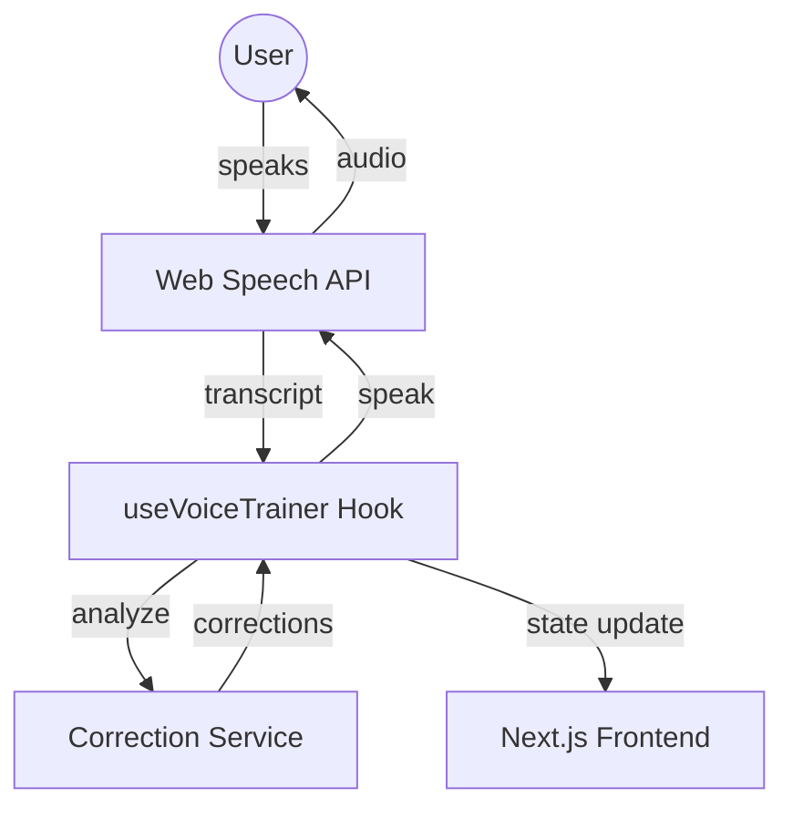

# LinguaLift-AI 🎙️

LinguaLift-AI is a premium, real-time English language practice application powered by AI. It provides an immersive environment for learners to practice speaking, receive instant grammar corrections, and improve their fluency through natural conversation.

---

## 🏗️ Architecture

LinguaLift-AI is built with a modern, reactive architecture using **Next.js** and the **Web Speech API**. The system is designed to provide low-latency feedback and a seamless user experience.

### System Flow
The application follows a circular feedback loop:
1. **User Input**: Captured via `SpeechRecognition` (Web Speech API).
2. **Analysis**: Processed through the `CorrectionService` to identify grammatical errors.
3. **AI Reasoning**: A contextual response is generated based on the user's input and practice topic.
4. **Voice Output**: The response is converted back to speech via `SpeechSynthesis`.

### Component Diagram (Mermaid)



---

## 🚀 Use Cases

LinguaLift-AI is designed for various learning scenarios:

| Use Case | Description | Primary Feature |
| :--- | :--- | :--- |
| **Job Interviews** | Prepare for common interview questions and refine professional language. | Contextual AI responses for career topics. |
| **Travel English** | Practice orderings at restaurants, checking into hotels, and asking for directions. | Real-time dialogue flow. |
| **Exam Prep (IELTS/TOEFL)** | Improve speaking scores by focusing on grammar accuracy and vocabulary variety. | Detailed correction feedback. |
| **Daily Fluency** | Build confidence for casual social interactions and networking. | Natural voice interaction. |

---

## 🛠️ Tech Stack

- **Framework**: Next.js 14 (App Router)
- **Styling**: Tailwind CSS (Modern, responsive design)
- **State Management**: React Hooks (useVoiceTrainer)
- **AI/Speech**: 
  - `webkitSpeechRecognition` for Speech-to-Text.
  - `speechSynthesis` for Text-to-Speech.
- **Logic**: TypeScript (Type-safe correction rules).

---

## 📈 Development Map

- [x] Initial Project Setup
- [x] Core Voice Hook Implementation
- [x] Rule-based Grammar Correction Engine
- [x] Responsive UI/UX Design
- [ ] LLM Integration (OpenAI/Gemini) for advanced reasoning.
- [ ] User Progress Tracking & Session History.

---

## 🏁 Getting Started

1. **Clone the repository**:
   ```bash
   git clone https://github.com/Wakjira-Tesama/LinguaLift-AI.git
   ```
2. **Install dependencies**:
   ```bash
   npm install
   ```
3. **Run the development server**:
   ```bash
   npm run dev
   ```
4. **Start Practicing**: Navigate to `/train` and enable your microphone!

---

Developed with ❤️ by [Wakjira Tesama](https://github.com/Wakjira-Tesama)
